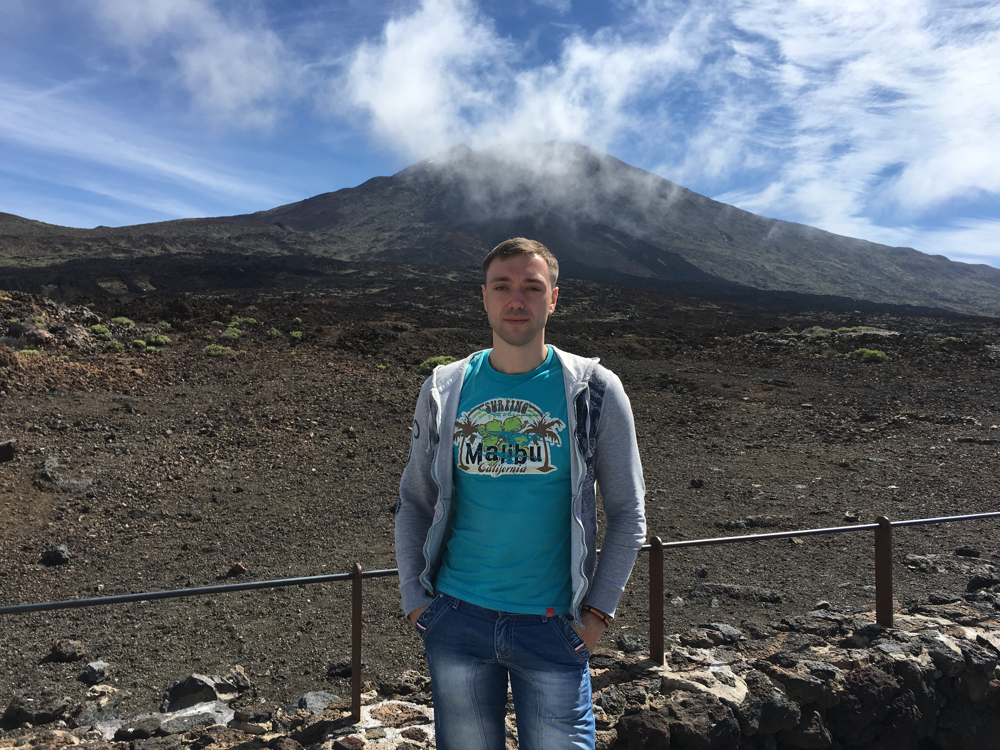

# Виталий Глушков

Номер телефона:    +79270120500
E-mail:            vit8@live.ru
Город проживания:  Самара

## Образование

2005-2008 г.Самара
**Поволжская Государственная Академия Телекоммуникаций и Информатики**
- Факультет: Сети связи и системы коммутации
- Квалификация: Инженер

2001-2005 г.Самара
**Самарский Авиационный Техникум**
- Факультет: Вычислительные машины комплексы системы и сети
- Квалификация: Техник

## Опыт работы

06.2018- по настоящее время г.Самара
**ООО «Техкомпания Хуавэй» (Huawei)**
- Должность: Ведущий инженер - проектировщик.
- Обязанности: Проверка и анализ технических решений для монтажа радио релейного оборудования Huawei, выставление замечаний и отправка проектов на доработку в случае наличия грубых нарушений или не соответствие проекта основным техническим требованиям заказчика. Подготовка перечня оборудования необходимого для строительства сайта в соответствии с проектом, для отгрузки и последующей доставки на сайты заказчика. Подготовка и согласование смет на строительно-монтажные работы для субподрядных организаций. Коррекция заказанных работ с заказчиком, формирование и согласование дополнительных работ с заказчиком, отработка возражений заказчика. Решение не типовых ситуаций ориентируясь на договор с заказчиком и субподрядчиком. Загрузка данных в платформы учета Huawei ISDP и ERP-PM.
- Достижения:
> - В декабре 2022 года получил награду компании "Month Star" за вклад в развитие и потдержку проекта "MicroWave" для заказчика Beeline.
> - В 2021 года получил благодарность Самарской губернской думы за добросовестный труд, высокий профессионализм и вклад в развитие информационных технологий и связи в Самарской области.
> - В 2019 году получил награду Huawei «War Hero» как лучший сотрудник департамента Site Integration, который в сложное для компании время привлек существенную дополнительную выручку со стороны заказчика.

05.2017 – 06.2018 г.Самара
**ПАО «ВымпелКом» (Beeline)**
- Должность: Старший инженер службы планирования и оптимизации мультисервисной сети.
- Обязанности: Предварительная проработка поступивших на расчет клиентских, операторских, сетевых и аварийных проектов: Анализ поступившей исходной информации. Определение ближайших точек присутствия ресурсов компании до предполагаемого места подачи запрошенного сервиса. Выбор наиболее оптимального способа и технологии организации последней мили для требуемой задачи. Анализ размещенного оборудования на узле связи или базовой станции и ознакомление с инвентарными справками на линии связи для использования в проекте. Построение оптимального маршрута на сети до точки терминации трафика. Оценка и уточнение возможных рисков, действующих запретов и ограничений, способных привести к невыполнению проекта, касающихся организации последней мили, а также узких мест на сети, отсутствия необходимого состава оборудования на узле связи или транспортном оборудовании базовой станции, портов, лицензий, емкости, размещения и питания планируемого оборудования, свободных волокон в кабеле или наличие незадействованных медных пар. Модернизация и переключение узлов связи с целью увеличения транспортной емкости для подачи запрашиваемых сервисов и увеличения потенциала последующих включений. Выбор необходимого оборудования, плат, модулей и лицензий в соответствии с уже используемым оборудованием согласно спецификациям производителя и возможным позициям для закупки не типового оборудования доступных в Компании. Для приоритетных проектов и операторских присоединений, расширений, переключений выделение и бронирование требуемых на сети ресурсов. Создание схем в Visio при необходимости наличия схем на этапе проекта. Оформление заключения затратной части технико-экономического обоснования. Детальная проработка поступивших на реализацию проектов в 1С Inventory: Создание схемы на сети согласно проекта и отображение планируемых линий связи и новых позиций в модулях учета компании NetX и SDB. Подготовка исходных данных. Выдача заявок согласно проекта, на соответствующие группы эксплуатаций и строителей. Устранение возможных нестыковок проекта в случае выявления таковых в процессе реализации, либо инициация изменения технического решения в случае невозможности без затратного, оперативного решения возникших трудностей.
- Достижения:
> - Спроектировал и запустил в реализацию проекты по организации каналов на объекты выдачи паспортов болельщиков к чемпионату мира по футболу 2018 по городу Самара.
> - Работа с бумажной документацией. Организация реестра инвентарных справок кабелей связи. Облегчающий поиск информации в первоисточниках.

11.2016-04.2017 г.Самара
**АО «ЭР-Телеком Холдинг»**
- Должность: Специалист.
- Обязанности: Работа с сегментом юридических лиц с целью продвижения услуг компании.
- Достижения:
> - Благодаря опыту и проведенным коммуникациям стала возможной оптимизация ресурсов компании и организовано комплексное подключение крупных юридических лиц в промзоне ПГТ Новосемейкино.

06.2006-08.2016 г.Самара
**ПАО «МегаФон»**
- Должность: Старший специалист
- Обязанности: Оценка поступившей информации, ведение соответствующих коммуникаций, презентация сложных телекоммуникационных решений, работа с выборками в базах данных, оформление сделок, сопровождение длительных проектов. Логистика склада B2B Самара.
- Достижения:
> - В 2015 году участвовал в проекте «Последняя миля». Передача, установка и консультация по работе 3G/4G репитеров малой мощности Cel-Fi ключевым корпоративным клиентам компании. 
> - В 2011 году создал рекомендацию-инструкцию по первичной установке фемтосоты и общим настройкам клиентского оборудования. Предоставляется клиентам Поволжского филиала ПАО «МегаФон» при выдаче фемтосот.
> - В 2014 году организовал и провел обучение сотрудников Федерального Центра Обслуживания Корпоративных клиентов (ФЦОКК) по работе с выборками, массовыми действиями и групповыми операциями, для оптимизации рабочего времени.
> - В 2012 году организовал взаимодействие по передаче документооборота КЦ и СРБР через CRM.

## Дополнительно
- Водительские права категории B
- Заграничный паспорт

---

