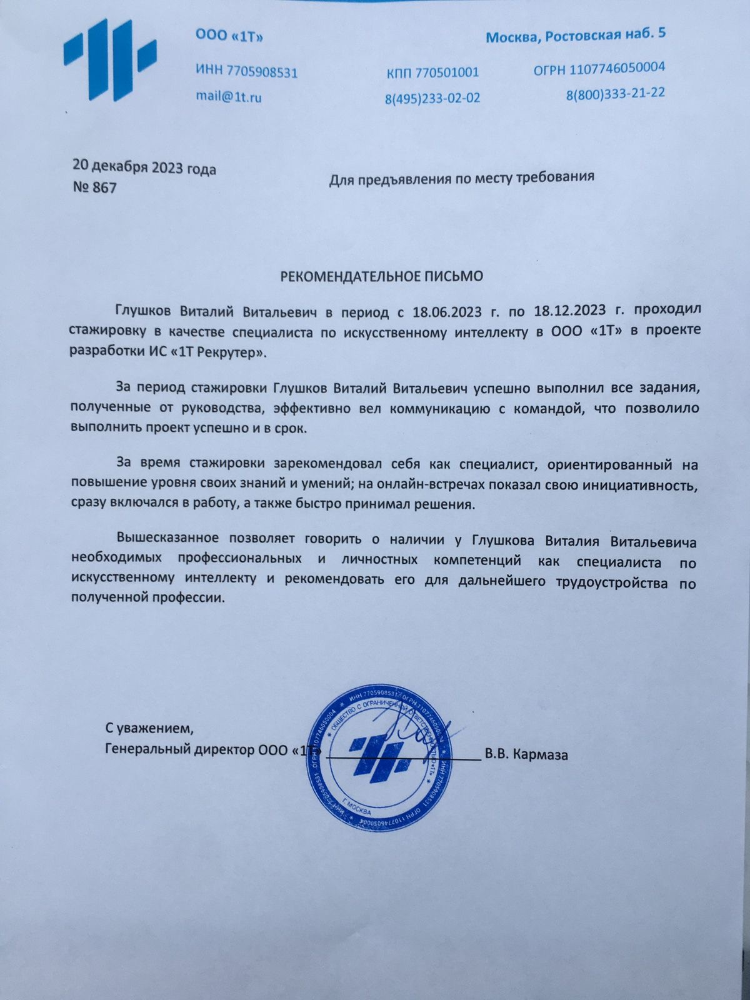
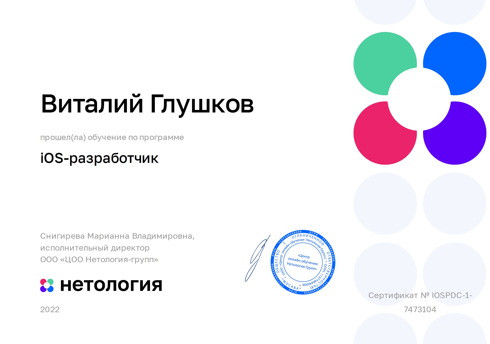
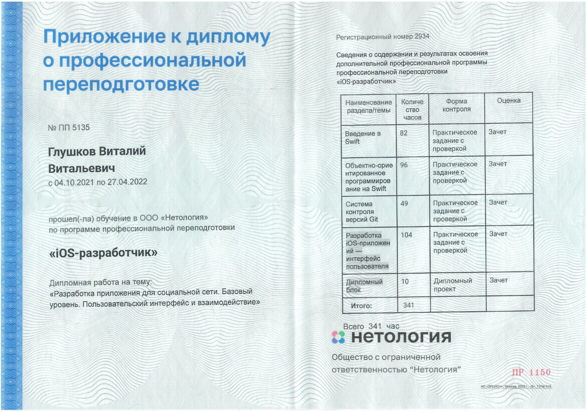
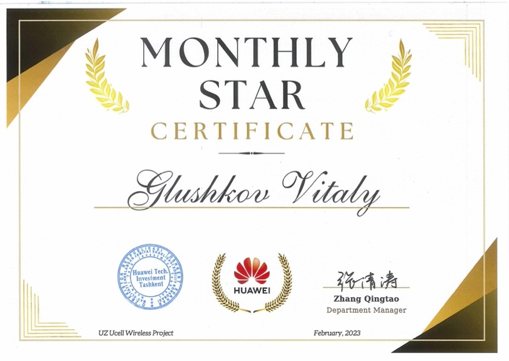
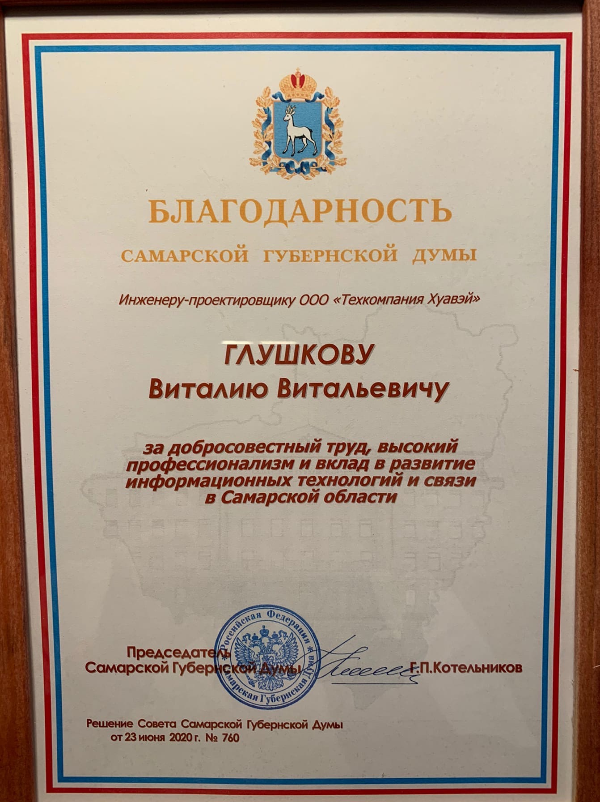

# Виталий Глушков

- Номер телефона:    +998900437510
- Телеграм:          @VitalyGlushkov
- E-mail:            glushkov.vv@me.com
- Город проживания:  Ташкент, Узбекистан
- Знание языков:     Русский – родной, Английский – B1 Pre-Intermediate
- GitHub:            [https://GitHub.com/GlushkovV](https://github.com/GlushkovV?tab=repositories)
- LinkedIn:          [https://www.LinkedIn.com/in/Vitaly-Glushkov](https://www.LinkedIn.com/in/Vitaly-Glushkov)

## Образование

2023 – 2023 онлайн
**ООО "1Т" Программа профессиональной переподготовки.**
- Факультет: Big Data и машинное обучение.
- Квалификация: Data Scientist (Python).

2021 - 2022 онлайн
**ООО «Нетология» Программа профессиональной переподготовки.**
- Факультет: iOS-разработчик.
- Квалификация: Инженер (Swift).

2005 - 2008 г.Самара
**Поволжская Государственная Академия Телекоммуникаций и Информатики.**
- Факультет: Сети связи и системы коммутации.
- Квалификация: Инженер.

2001 - 2005 г.Самара
**Самарский Авиационный Техникум.**
- Факультет: Вычислительные машины комплексы системы и сети.
- Квалификация: Техник.

## Опыт работы

06.2023 – 12.2023 удаленная стажировка
**ООО "1Т".**
- Должность: Data Scientist. Стажировка.
- Обязанности: Парсинг данных сайтов вакансий, очистка данных, разработка концепции реализации проекта, создание моделей машинного обучения и глубокого обучения (нейронных сетей) для реализации проекта агрегатора вакансий платформы 1T.

01.2023 – настоящее время, г.Ташкент, Узбекистан
**Huawei Technologies Co., Ltd.**
- Должность: Инженер, легализация объектов телекоммуникации.
- Обязанности: Легализация базовых станций для оператора Ucell. Подготовка и проверка документов (R1R2) для оператора связи и государственных ведомств.
- Достижения:
> - Оптимизировал процесс подготовки документов для государственных органов путем внедрения обновленных форматов документов, что уменьшило время необходимое для подготовки документов. Это сократило расходы на персонал и сэкономило проекту 0.25 миллиона долларов на работах субподрядных организаций. На данный момент некоторые из обновленных форматов документов используются на всей территории Республики Узбекистан (Санитарный паспорт).
> - Оптимизирован процесс подготовки легализационных документов для Ucell. На данный момент компания Ucell использует их для подготовки собственных документов, не связанных с Huawei.
> - В феврале 2023г. за отличную работу над проектом Ucell получил награду "Month Star".

06.2018 - 12.2022 удаленная работа
**ООО «Техкомпания Хуавэй» (Huawei).**
- Должность: Ведущий инженер - проектировщик.
- Обязанности: Проверка и анализ технических решений, подготовка перечня оборудования для монтажа телекоммуникационного оборудования Huawei. Оценка объемов работ для формирования заказов. Согласование перечня работ с заказчиком и субподрядными организациями.
- Достижения:
> - В декабре 2021 года получил награду компании "Month Star" за вклад в развитие и поддержку проекта "MicroWave" для заказчика Beeline.
> - В 2020 года получил благодарность Самарской губернской думы за добросовестный труд, высокий профессионализм и вклад в развитие информационных технологий и связи в Самарской области.
> - Награда, подписанная вице-президентом Евразийского региона Huawei, была вручена в 2019 году как лучшему сотруднику департамента Site Integration за оптимизацию бизнес-процессов и привлечение дополнительной выручки свыше 10 миллион рублей от заказчика.

05.2017 – 06.2018 г.Самара
**ПАО «ВымпелКом» (Beeline).**
- Должность: Старший инженер службы планирования и оптимизации мультисервисной сети.
- Обязанности: Проектирование технических решений для строительства, модернизации и переключения узлов и линий связи. Создание схем сети в Visio и модулях учета компании NetX и SDB. Оформление заключений затратной части технико-экономического обоснования.
- Достижения:
> - Спроектировал и запустил в реализацию проекты по организации каналов на объекты выдачи паспортов болельщиков к чемпионату мира по футболу 2018 по городу Самара.
> - Организовал реестр инвентарных справок объектов и кабелей связи для оптимизации поиска информации в первоисточниках.

11.2016 - 04.2017 г.Самара
**АО «ЭР-Телеком Холдинг.»**
- Должность: Специалист.
- Обязанности: Работа с сегментом юридических лиц с целью продвижения услуг компании.
- Достижения:
> - Оптимизировал ресурсы компании, переведя действующих клиентов с арендованных на собственные каналы связи оператора.
> - Организовал комплексное подключение крупных юридических лиц в промзоне ПГТ Новосемейкино Самарской области.

06.2006 - 08.2016 г.Самара
**ПАО «МегаФон».**
- Должность: Старший специалист по сопровождению и развитию крупных корпоративных клиентов.
- Обязанности: Опыт работы с сегментом B2C. Работа с сегментом B2B:
  - формирование коммерческих предложений, проведение презентаций высокотехнологичных телекоммуникационных решений, оформление сделок;
  - сопровождение длительных проектов, проведение встреч и переговоров;
  - контроль лояльности, оттока и выручки от клиентов, контроль и решение претензионных обращений;
  - конфигурирование настроек сети на абонентском оборудовании;
  - работа с выборками в базах данных, анализ клиентской базы;
  - оптимизация текущих бизнес-процессов;
  - организация внутрикорпоративного обучения, наставничеств;
  - управление группой сотрудников численностью более 100 сотрудников; 
  - ведение склада B2B, осуществление финансовых расчетов.
- Достижения:
> - Реализовал проект «Последняя миля»: передача, установка и консультация по работе 3G/4G репитеров малой мощности Cel-Fi ключевым корпоративным клиентам.
> - Организовал проведение обучения сотрудников Федерального Центра Обслуживания Корпоративных Клиентов по работе с выборками, массовыми действиями и групповыми операциями в биллинговой системе, для оптимизации бизнес-процессов.
> - Организовал процесс документооборота контакт-центра и корпоративного отдела посредством CRM.
> - Разработал рекомендацию-инструкцию по первичной установке фемтосоты и общим настройкам клиентского оборудования. Предоставляется всем клиентам Поволжского филиала ПАО «МегаФон» при выдаче фемтосот.
> - Реализовал перевод функционала группы дистанционного обслуживания ключевых и корпоративных клиентов из г Самара в г Пенза. Организовал работу новой группы численностью более 100 сотрудников.
> - Разработал обучающий материал для новых сотрудников по работе с биллинговой системой.
> - Разработал обучающие материалы и методические процедуры по работе с
 корпоративными и высокодоходными клиентами для сотрудников контакт-центра.

## Дополнительно
- Водительские права категории B.
- Заграничный паспорт.

---

