# Vitaly Glushkov

- Mobile number:            +998900437510, +79276000601
- Telegram:                 @VitalyGlushkov
- E-mail:                   glushkov.vv@me.com
- Living:                   Tashkent, Uzbekistan
- Languages:                Russian – Native, English – B1 Pre-Intermediate
- GitHub:                   [https://GitHub.com/GlushkovV](https://github.com/GlushkovV?tab=repositories)
- LinkedIn:                 [https://www.LinkedIn.com/in/Vitaly-Glushkov](https://www.LinkedIn.com/in/Vitaly-Glushkov)

## Education

2023 – 2023 online
**LLC "1T" Professional retraining program.**
- Faculty: Big Data and Machine learning
- Qualification: Data Scientist (Python).

2021 - 2022 online
**LLC " Netology" Professional retraining program.**
- Faculty: iOS-Developer.
- Qualification: Engineer (Swift).

2005 - 2008 Samara, Russia
**State Educational Institution of Higher Professional Education "Volga State Academy of Telecommunications and Informatics".**
- Faculty: Telecommunication networks and switching systems.
- Qualification: Engineer.

2001 - 2005 Samara, Russia
**State Educational Secondary Vocational Education "Samara Aviation Technical College".**
- Faculty: Computing machines, complexes, systems and networks.
- Qualification: Technician.

## Work experience

06.2023 – 12.2023 remote internship
**LLC "1T".**
- Position: Data Scientist. Internship.
- Responsibilities: Job site data parsing, data cleaning, project concept development, creation of machine learning and deep learning models (neural networks) for the implementation of the 1T platform Vacancy Aggregator project.

01.2023 – Present, Tashkent, Uzbekistan
**Huawei Technologies Co., Ltd.**
- Position: Legalization Specialist.
- Responsibilities: Legalization of base stations for Ucell. Preparation and verification of documents (R1R2) for a telecommunications company and government departments.
- Achievements:
> - Optimized the process of preparing documents for government agencies by introducing an updated documents formats which has reduced the time required to prepare documents. This reduced personnel costs and saved the project $250,000 in subcontractor work. At the moment, some of the updated document formats are used throughout the territory of the Republic of Uzbekistan (Sanitary Passport).
> - Optimized the process of preparing legalization documents for Ucell. At the moment, Ucell company is used to prepare its own documents not related to Huawei. 
> - In February 2023, the Month Star award was given for excellent work on the Ucell project.

06.2018 - 12.2022 remote work
**Huawei Technologies Co., Ltd.**
- Position: Leading design engineer.
- Responsibilities: Verification and analysis of technical solutions, preparation of a list of equipment for the installation of Huawei telecommunications equipment. Volume work Estimation for making orders. Task list Coordination with the customer and subcontractors.
- Achievements:
> - December 2021, the Month Star award was given for contribution to the development and support of the MicroWave project for the Beeline customer.
> - Samara government region acknowledgment was given in 2020 for conscientious duties performance, high professionalism and contribution to the information development technologies and telecommunications in the Samara region.
> - The award, signed by the Vice President of the Eurasia region Huawei company, was given in 2019 as the best employee of the Site Integration department for optimizing business processes and attracting additional revenue of over 10 million rubles (170 000$) for the first half of the year.

05.2017 – 06.2018 Samara, Russia
**PJSС VimpelCom (Beeline, VEON Holding).**
- Position: Senior Engineer of the Multiservice Network Planning and Optimization Service.
- Responsibilities: Technical Design solutions for the construction, modernization and switching of hubs and communication lines. Creating network diagrams in Visio and NetX and SDB accounting modules. Execution of conclusions of the cost part of the feasibility study.
- Achievements:
> - Designed and launched projects for the organization of channels for Fan ID issuing points for the 2018 FIFA World Cup in Samara.
> - Organized a register certificates inventory of objects and communication cables to optimize the search for information in primary sources.

11.2016 - 04.2017 Samara, Russia
**JSC ER-Telecom Holding.**
- Position: Specialist.
- Responsibilities: Working with legal entities segment in order to promote the company's services.
- Achievements:
> - Optimized the company's resources by transferring existing customers from leased channels of other operators to the operator's own communication channels.
> - Organized a comprehensive connection of large legal entities in the industrial zone of the Novosemeikino village of the Samara region.

06.2006 - 08.2016 Samara, Russia
**PJSС MegaFon.**
- Position: Senior Specialist in support and development of key corporate clients.
- Responsibilities: Working experience with the B2C segment is available. Working with the B2B segment:
  - commercial proposals creating, presentations of high-tech telecommunications solutions, transactions execution; 
  - long-term projects support, meetings and negotiations; 
  - loyalty control, outflow and revenue from customers, control and claims solving; 
  - configuring network settings on subscriber equipment;
  - working with selections in databases, analyzing the client base;
  - current business optimization processes;
  - internal corporate organization training, mentoring;
  - managing a group of employees with more than 100 employees;
  - maintaining a B2B warehouse, making financial calculations.
- Achievements:
> - Implemented the project "Last Mile": transfer, installation and consultation on the exploitation of 3G/4G low-power repeater Cel-Fi to key corporate clients. 
> - Organized the training of employees of the Federal Center for Corporate Customer Service on working with selections, mass actions and group operations in the billing system to optimize business processes.
> - Organized the workflow of exchanging client requests between the call-center and the corporate department through CRM.
> - Created a manual for the initial installation of femtocells and general settings of client network equipment. It is provided to all customers of the Volga branch of PJSC MegaFon when issuing femtocells.
> - Implemented the transfer of the functionality of the VIP and corporate clients remote service group from Samara to Penza. Organized the work of a new group of more than 100 employees.
> - Developed training material for new employees on working with the billing system.
> - Developed training materials and methodologies for working with corporate and highly profitable clients for call-center employees.

## Additionally
- Category B driver's license.
- A foreign passport.

---

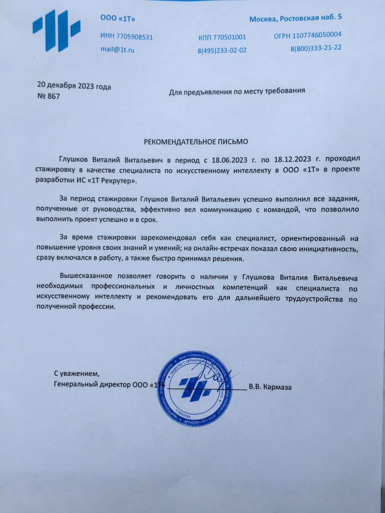
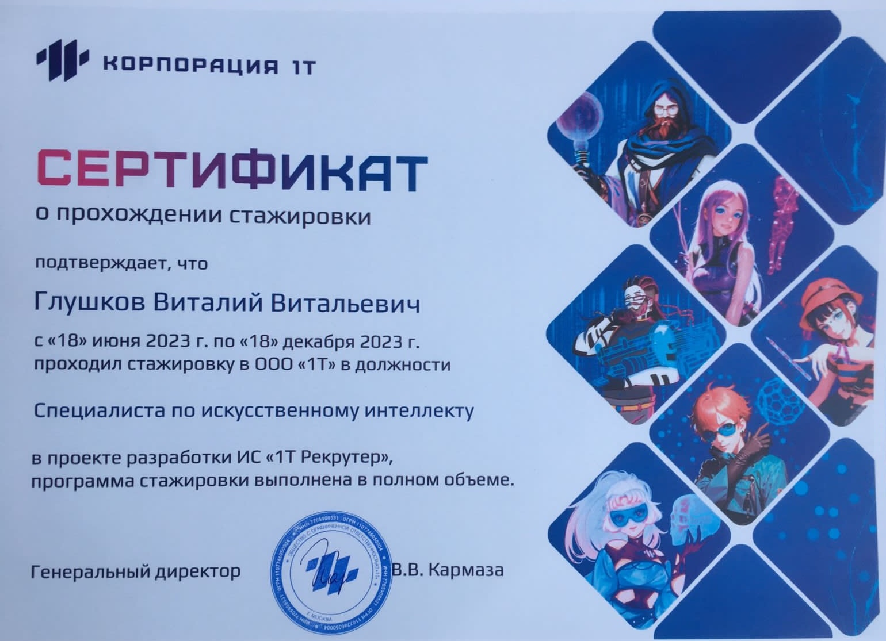
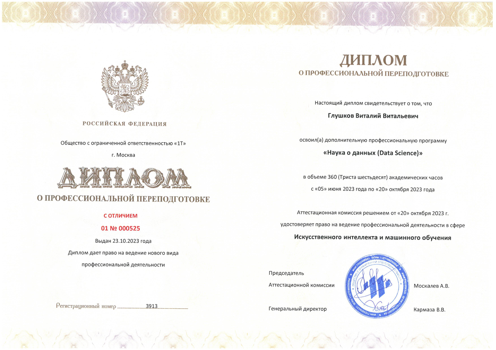
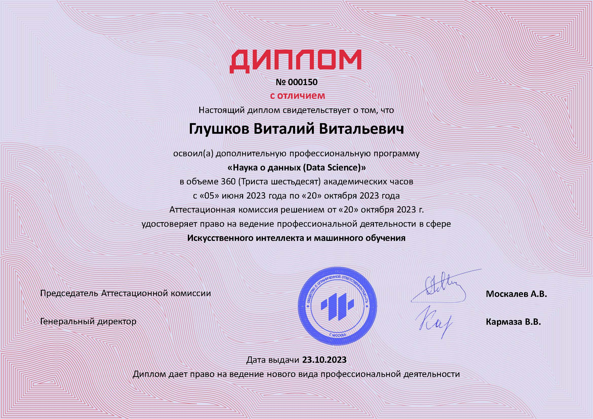
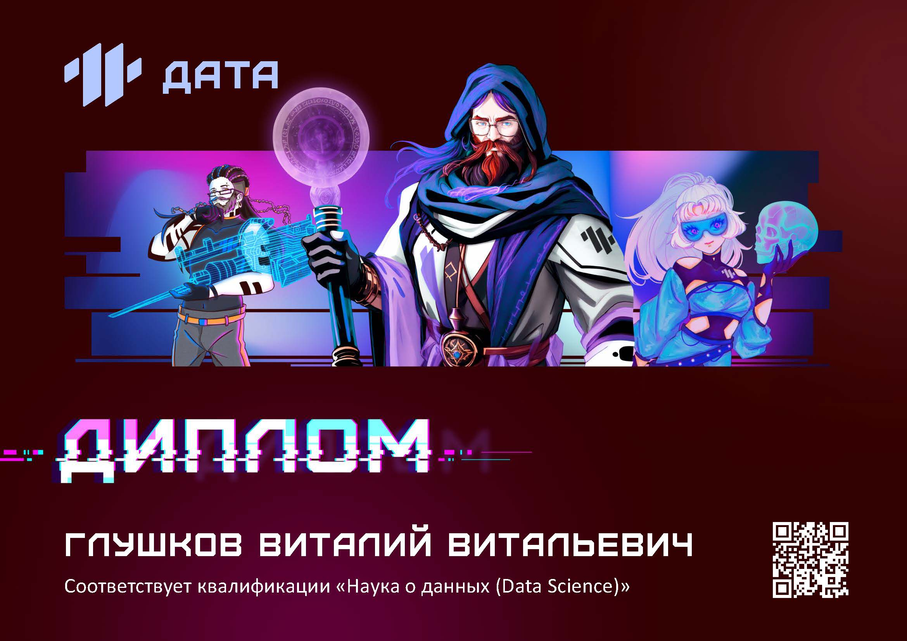
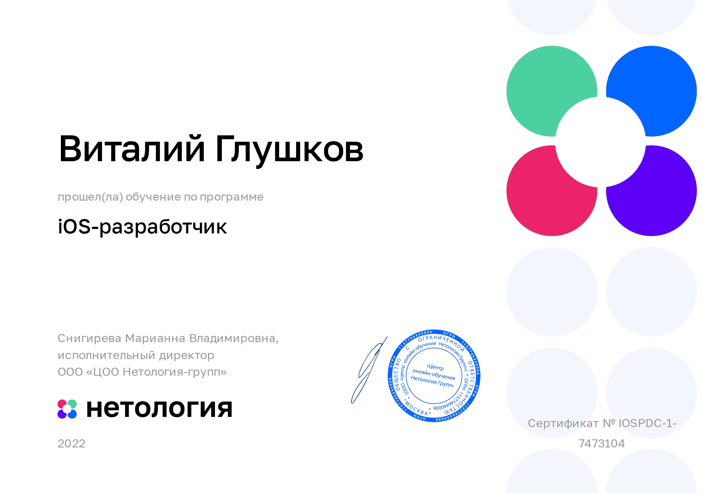

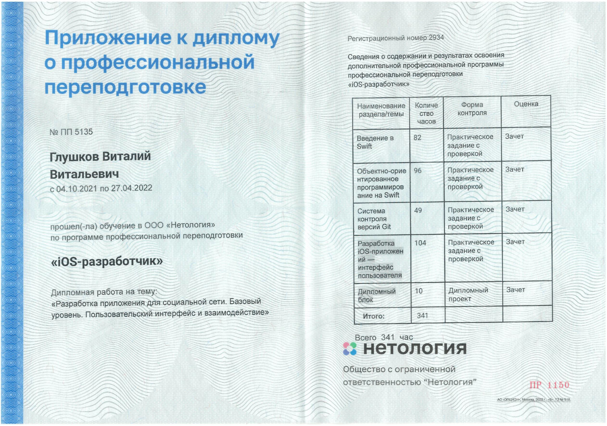
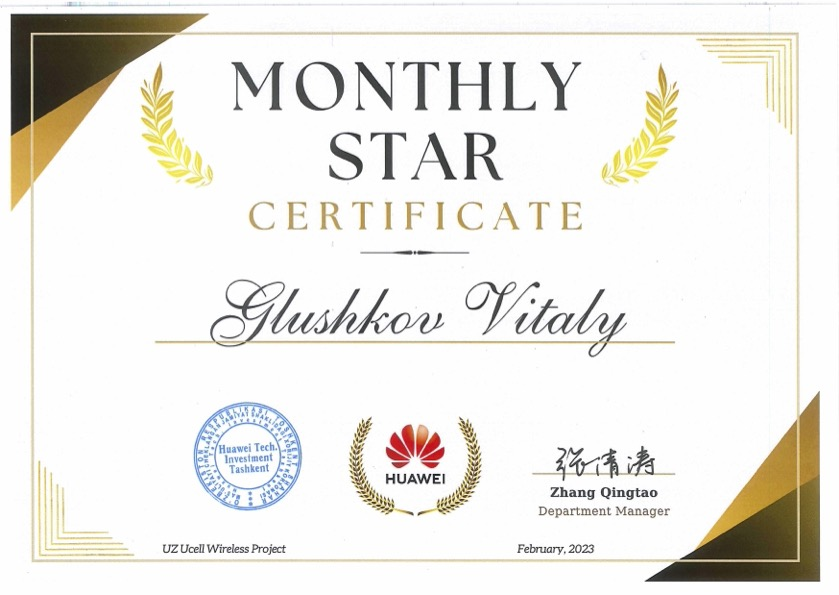
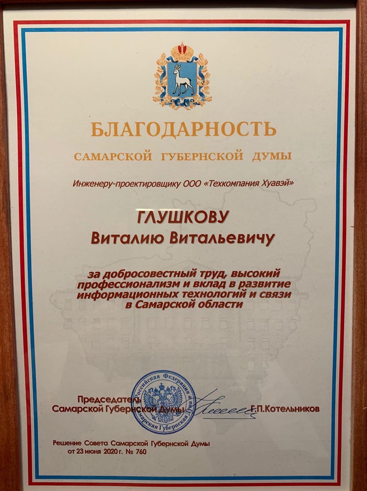
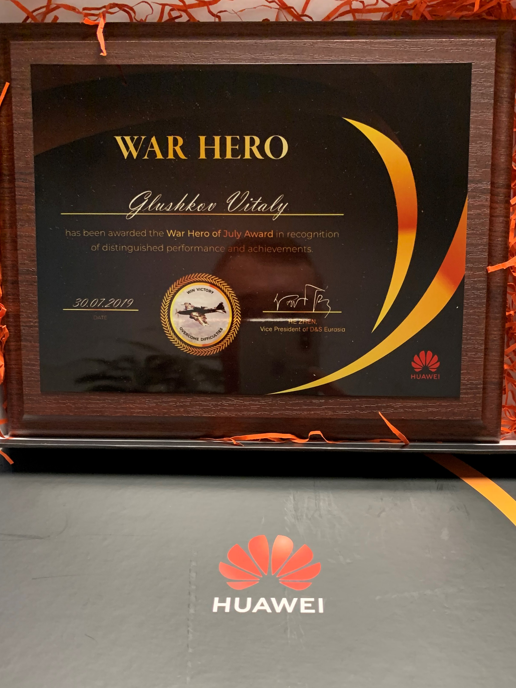
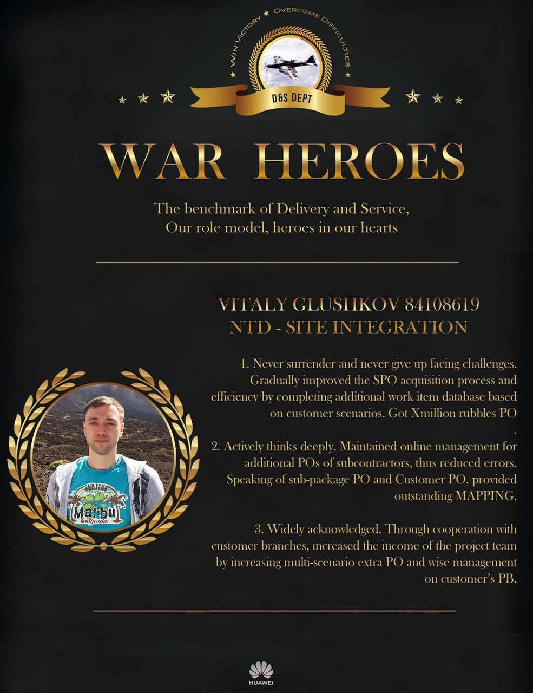
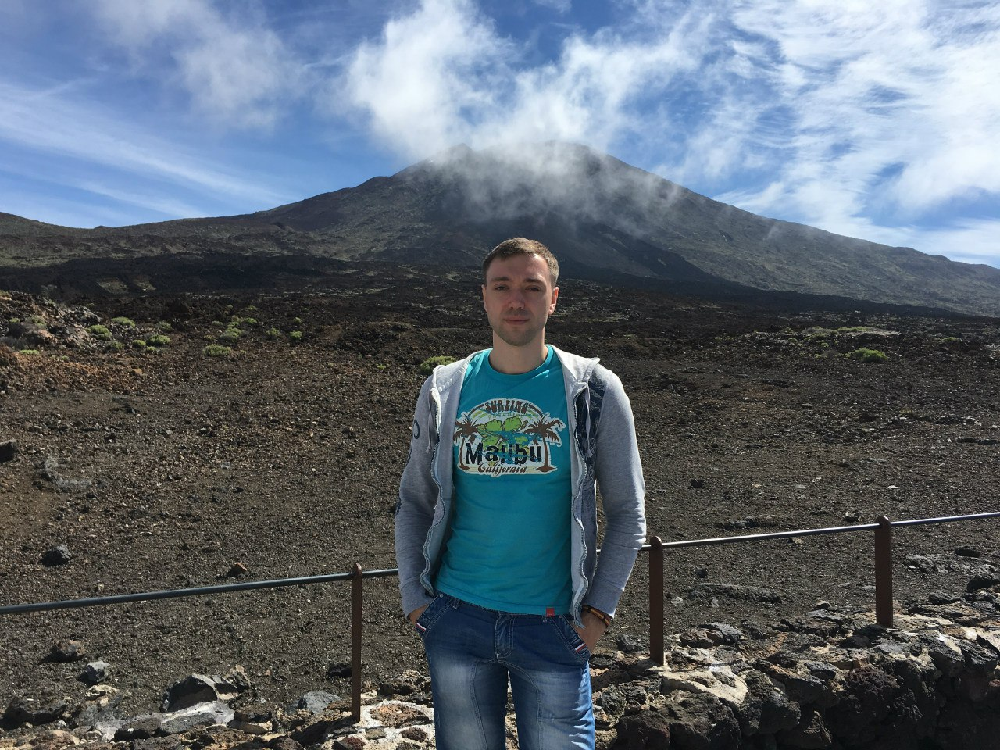
